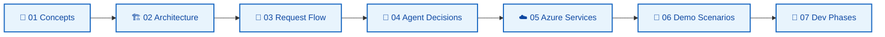

# Documentation — Enterprise AI Sales Intelligence

**Learning documentation** for the Microsoft Azure AI Solution Engineering POC. All diagrams use **Mermaid** (`flowchart`, `sequenceDiagram`, `stateDiagram-v2`) — avoid `block-beta` (limited support in some viewers).

## How to study

1. Read in numeric order under [`learn/`](learn/) — each guide builds on the previous one.
2. Use **deep dives** when you need technical detail.
3. Read **ADRs** to understand *why* each technology was chosen.
4. Keep [`PLAN.md`](PLAN.md) as the normative spec (what *must* be implemented).

## Learning path (`learn/`)

| # | Document | What you learn |
|---|----------|----------------|
| 01 | [concepts.md](learn/01-concepts.md) | Agent vs chatbot, RAG, MCP, grounding, citations |
| 02 | [architecture-overview.md](learn/02-architecture-overview.md) | Components, layers, monorepo, architectural principle |
| 03 | [request-flow.md](learn/03-request-flow.md) | Full sequence: Vue → API → Agent → MCP/RAG → LLM |
| 04 | [agent-decisions.md](learn/04-agent-decisions.md) | When to use MCP, RAG, or both — decision tree |
| 05 | [azure-services.md](learn/05-azure-services.md) | OpenAI, AI Search, Blob, Container Apps, Entra ID |
| 06 | [demo-scenarios.md](learn/06-demo-scenarios.md) | Five demo scenarios with expected flows |
| 07 | [development-phases.md](learn/07-development-phases.md) | Phase 1→6 — what to implement at each step |

## Deep dives (technical reference)

| Document | Content |
|----------|---------|
| [architecture.md](architecture.md) | Target architecture, local vs Azure deployment, modules |
| [mcp.md](mcp.md) | Model Context Protocol, tools, HTTP transport |
| [rag.md](rag.md) | Ingestion pipeline, chunking, hybrid search, citations |
| [security.md](security.md) | Entra ID, RBAC, authorization, secrets |
| [observability.md](observability.md) | Application Insights, agent telemetry |
| [cost.md](cost.md) | $50 budget, cost drivers, optimizations |
| [azure-access.md](azure-access.md) | Agent Azure bootstrap — RBAC, scripts, what to grant |
| [stack.md](stack.md) | Stack summary, ports, skills |

## Architecture Decision Records (`adrs/`)

| ADR | Title |
|-----|-------|
| [ADR-001](adrs/ADR-001-semantic-kernel.md) | Why Semantic Kernel |
| [ADR-002](adrs/ADR-002-mcp.md) | Why MCP |
| [ADR-003](adrs/ADR-003-azure-ai-search.md) | Why Azure AI Search |
| [ADR-004](adrs/ADR-004-rag-vs-structured-api.md) | RAG vs structured API access |
| [ADR-005](adrs/ADR-005-local-vs-azure.md) | Local development vs Azure |
| [ADR-006](adrs/ADR-006-agent-security.md) | Agent security model |

## Specification and operations

| Document | Role |
|----------|------|
| [PLAN.md](PLAN.md) | Full specification (52 sections) — source of truth |
| [../AGENTS.md](../AGENTS.md) | Rules for AI agents in this repo |
| [../README.md](../README.md) | Project overview |

## Maintenance rule

**Whenever you implement a feature**, update:

1. The matching `learn/` guide (flow + sequence diagram)
2. Deep dive if contract or architecture changed
3. ADR if irreversible decision or new rejected alternative
4. [`release-history.json`](release-history.json) on `/commit-push`

Cursor doc skills: `design-doc-mermaid`, `documentation-and-adrs`.

**Language:** all documentation in this folder is **English only**.
