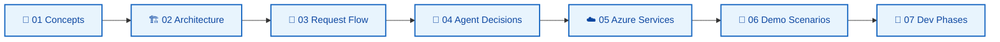

# Documentation — Enterprise AI Sales Intelligence

Documentação de **aprendizado** para a POC Microsoft Azure AI Solution Engineering. Todo diagrama usa **Mermaid** (`flowchart`, `sequenceDiagram`, `stateDiagram-v2`) — evite `block-beta` (suporte limitado em alguns viewers).

## Como estudar

1. Leia na ordem numérica em [`learn/`](learn/) — cada guia assume o anterior.
2. Consulte os **deep dives** quando precisar de detalhe técnico.
3. Leia os **ADRs** para entender *por que* cada tecnologia foi escolhida.
4. Mantenha [`PLAN.md`](PLAN.md) como especificação normativa (o que *deve* ser implementado).

## Trilha de aprendizado (`learn/`)

| # | Documento | O que você aprende |
|---|-----------|-------------------|
| 01 | [concepts.md](learn/01-concepts.md) | Agent vs chatbot, RAG, MCP, grounding, citations |
| 02 | [architecture-overview.md](learn/02-architecture-overview.md) | Componentes, camadas, monorepo, princípio arquitetural |
| 03 | [request-flow.md](learn/03-request-flow.md) | Sequência completa: Vue → API → Agent → MCP/RAG → LLM |
| 04 | [agent-decisions.md](learn/04-agent-decisions.md) | Quando usar MCP, RAG ou ambos — árvore de decisão |
| 05 | [azure-services.md](learn/05-azure-services.md) | OpenAI, AI Search, Blob, Container Apps, Entra ID |
| 06 | [demo-scenarios.md](learn/06-demo-scenarios.md) | Os 5 cenários demo com fluxos esperados |
| 07 | [development-phases.md](learn/07-development-phases.md) | Phase 1→6, o que implementar em cada etapa |

## Deep dives (referência técnica)

| Documento | Conteúdo |
|-----------|----------|
| [architecture.md](architecture.md) | Arquitetura alvo, deployment local vs Azure, módulos |
| [mcp.md](mcp.md) | Model Context Protocol, tools, transport HTTP |
| [rag.md](rag.md) | Pipeline ingestion, chunking, hybrid search, citations |
| [security.md](security.md) | Entra ID, RBAC, authorization, secrets |
| [observability.md](observability.md) | Application Insights, telemetria do agent |
| [cost.md](cost.md) | Budget $50, recursos que custam, otimizações |
| [stack.md](stack.md) | Stack resumida, portas, skills |

## Architecture Decision Records (`adrs/`)

| ADR | Título |
|-----|--------|
| [ADR-001](adrs/ADR-001-semantic-kernel.md) | Why Semantic Kernel |
| [ADR-002](adrs/ADR-002-mcp.md) | Why MCP |
| [ADR-003](adrs/ADR-003-azure-ai-search.md) | Why Azure AI Search |
| [ADR-004](adrs/ADR-004-rag-vs-structured-api.md) | RAG vs structured API access |
| [ADR-005](adrs/ADR-005-local-vs-azure.md) | Local development vs Azure |
| [ADR-006](adrs/ADR-006-agent-security.md) | Agent security model |

## Especificação e operação

| Documento | Papel |
|-----------|-------|
| [PLAN.md](PLAN.md) | Especificação completa (52 seções) — fonte da verdade |
| [../AGENTS.md](../AGENTS.md) | Regras para agentes de IA no repo |
| [../README.md](../README.md) | Visão geral do projeto |

## Regra de manutenção

**Sempre que implementar uma feature**, atualizar:

1. O guia `learn/` correspondente (fluxo + diagrama de sequência)
2. Deep dive se mudar contrato ou arquitetura
3. ADR se for decisão irreversível ou nova alternativa rejeitada
4. [`release-history.json`](release-history.json) no `/commit-push`

Skills Cursor para docs: `design-doc-mermaid`, `documentation-and-adrs`.
