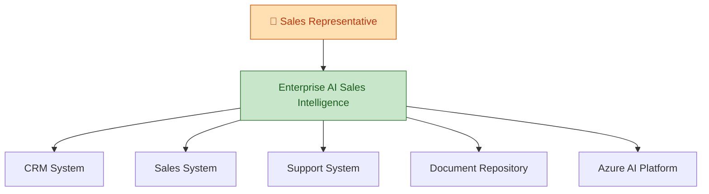
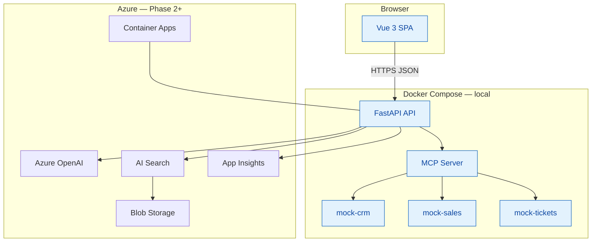
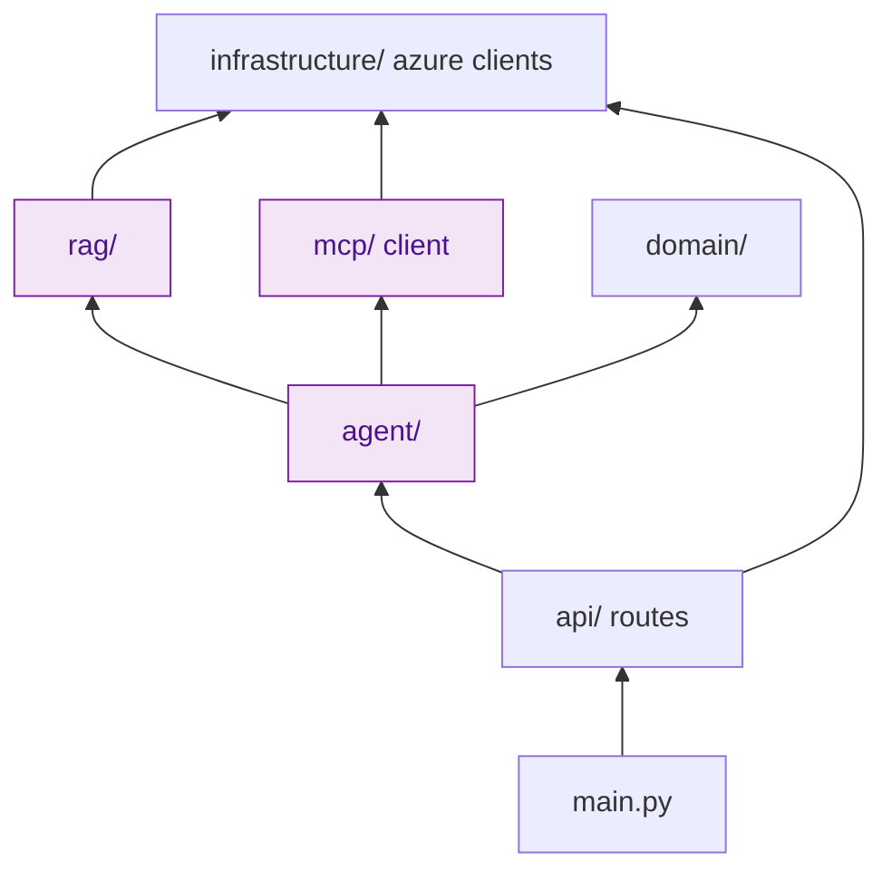
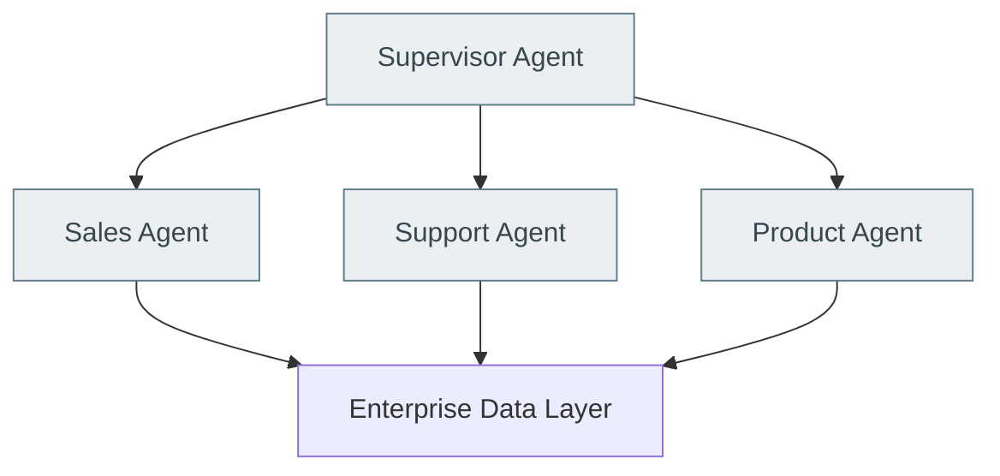

# System Architecture

Consolidated architecture reference. Learning path: [`learn/`](learn/).

## Goals

1. **Enterprise agent** — not a generic chatbot
2. **Thin vertical slices** — Phase 1 runnable before Azure
3. **Separation of concerns** — HTTP ≠ Agent ≠ MCP ≠ RAG
4. **Grounded responses** — citations + FACT vs RECOMMENDATION
5. **Azure-ready** — path to Container Apps, Entra, Key Vault

## C4 — Context diagram

## C4 — Container diagram

## Module dependencies (apps/api)

**Dependency rule:** `domain/` has zero imports from `infrastructure/` or Azure SDKs.

## Production evolution (future)

Not implemented in POC — documented for interview "From POC to Production".

## Related docs

- [mcp.md](mcp.md) — MCP server design
- [rag.md](rag.md) — RAG pipeline
- [security.md](security.md) — auth model
- [observability.md](observability.md) — telemetry
- [adrs/](adrs/) — decision records
