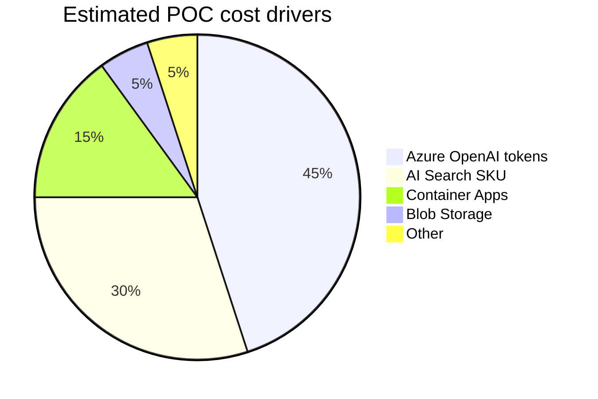
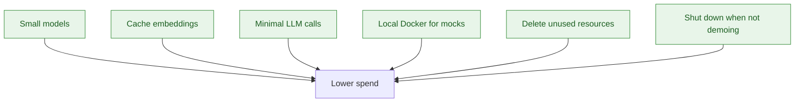

# Cost Strategy

Azure credits are **not** a budget to spend entirely. Target: demonstrate architecture under **~$50** with alerts.

## Budget alerts (configure in portal)

```text
Budget: $50
Alerts: 50% | 75% | 90% | 100%
```



## Cost by resource

| Resource | Cost driver | POC mitigation |
|----------|-------------|----------------|
| Azure OpenAI | Chat + embedding tokens | `gpt-4o-mini`, `text-embedding-3-small` |
| AI Search | SKU tier + replicas | Basic tier, single replica |
| Container Apps | vCPU-seconds + memory | Scale to zero when idle |
| Blob Storage | GB stored | Small demo dataset only |
| App Insights | Ingestion volume | Sample/debug only in POC |

## Principles



1. Use small/appropriate AI models
2. Avoid unnecessary LLM calls (good tool routing helps)
3. Cache embeddings — do not re-embed unchanged docs
4. Keep dataset small (ACME demo only)
5. Local Docker for mock enterprise systems — free
6. Configure budget alerts before Phase 2
7. Delete resource group when POC complete

## Free tier / credits context

Azure free account: **$200 credit / 30 days** for new customers.

- POC architecture demo does **not** require maxing credits
- Phase 1 is **$0 Azure** (local only)
- Create Azure resources only when entering Phase 2+

## Cleanup checklist

```bash
# When POC demo is done:
az group delete --name rg-ai-sales-poc --yes --no-wait
```

Verify in portal: no orphaned Search/OpenAI resources in other groups.

## Related

- [learn/05-azure-services.md](learn/05-azure-services.md)
- [PLAN.md §9 and §35](PLAN.md)
