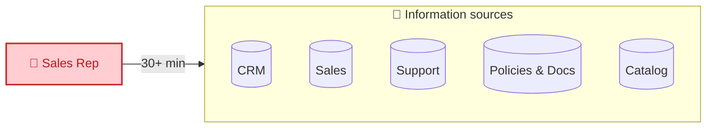
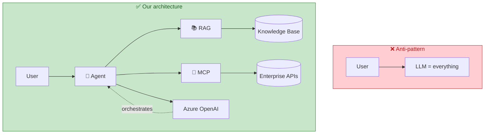
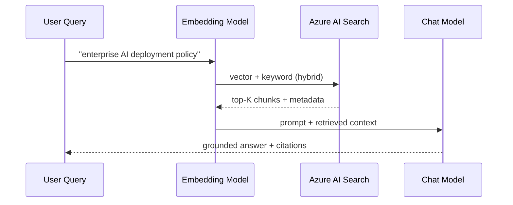
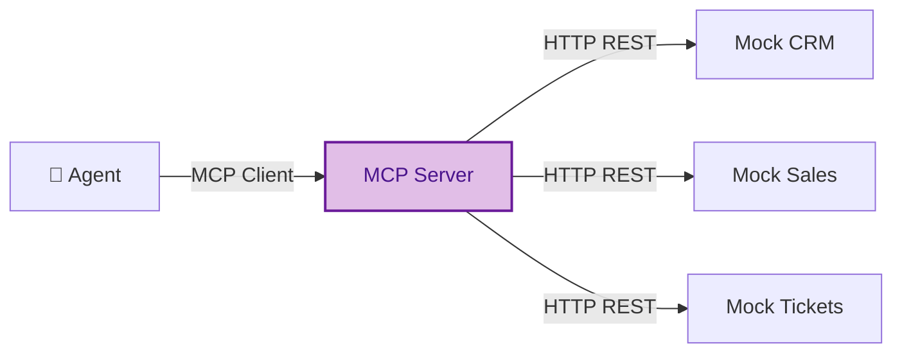
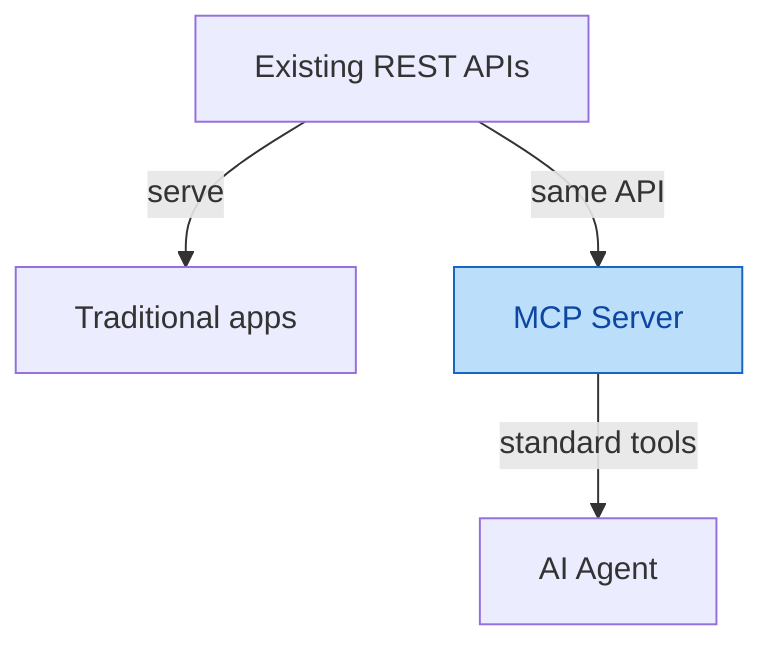
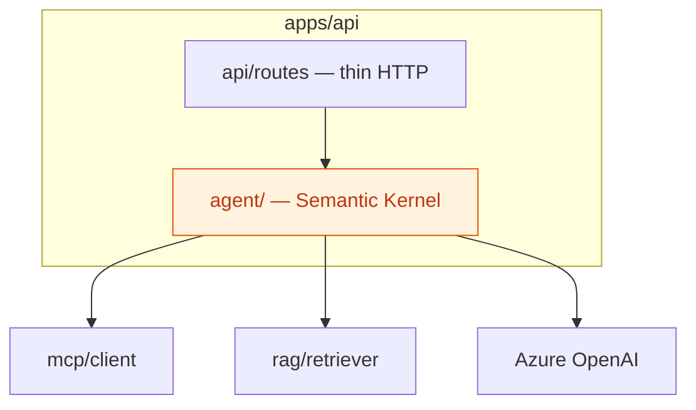
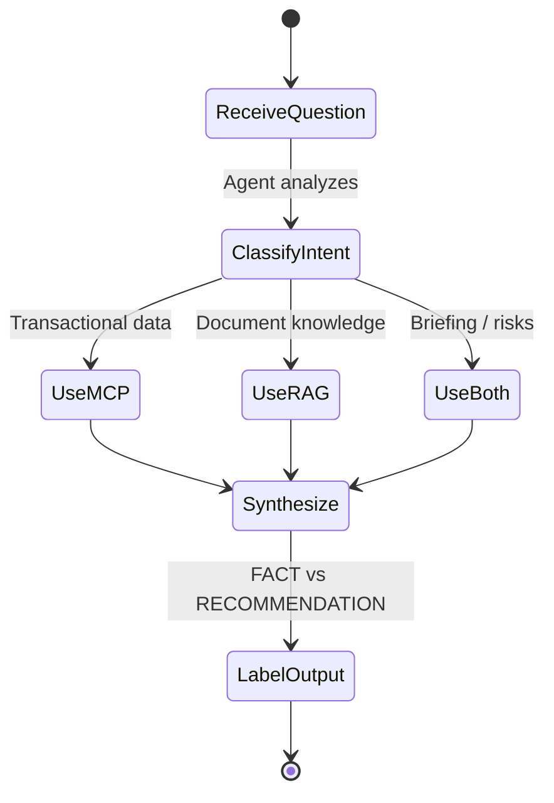

# 01 — Core Concepts

Before writing code, understand **what** we are building and **why** it is not a ordinary chatbot.

## Business problem

Enterprise sales reps need information scattered across many systems:

**POC goal:** reduce meeting prep to **under 5 minutes** with an agent that knows *where to fetch* each type of information.

## Chatbot vs enterprise agent

| | Generic chatbot | Sales Intelligence Agent |
|---|-----------------|--------------------------|
| Data source | Model only (parametric memory) | MCP (APIs) + RAG (documents) |
| Transactional data | Invents or stale | MCP → real REST APIs |
| Internal policies | Hallucinates | RAG → Azure AI Search |
| Tool selection | Fixed or none | Agent picks MCP / RAG / both |
| Citations | Optional | Required on RAG answers |
| Fact vs opinion | Mixed | UI separates FACT vs AI RECOMMENDATION |

> **Golden rule:** the LLM **orchestrates**; it is not the company's knowledge base.

## RAG — Retrieval-Augmented Generation

**RAG** = retrieve relevant documents *before* generating the answer.

**When to use RAG:**

- Internal policies
- Product documentation
- Contracts (PDF/Markdown)
- Any knowledge that **changes** and is **not** in a structured API

**When NOT to use RAG:**

- "How much did ACME spend last year?" → transactional → **MCP**

## MCP — Model Context Protocol

**MCP** exposes enterprise capabilities as **tools** the agent invokes.

**Planned tools:**

| Tool | Source | Example use |
|------|--------|-------------|
| `get_customer` | CRM | ACME profile |
| `get_customer_sales` | Sales | Revenue, trend |
| `get_customer_tickets` | Tickets | Open issues |
| `get_customer_contracts` | Contracts | Renewal date |
| `search_products` | Products | Catalog |
| `get_product` | Products | Product detail |

**Why MCP instead of rewriting APIs for AI?**

MCP is an **AI integration layer** — it does not duplicate business rules.

## Semantic Kernel — orchestration

**Semantic Kernel (SK)** is Microsoft's framework for:

- Plugging in LLM (Azure OpenAI)
- Registering plugins / functions
- Connecting MCP tools
- Keeping **prompts** and **orchestration** out of HTTP controllers

## Grounding, citations, and responsible AI

| Concept | Meaning in this project |
|---------|-------------------------|
| **Grounding** | Answer based on retrieved evidence (RAG or API) |
| **Citation** | List real sources (`contract-acme.pdf`, `renewal-policy.md`) |
| **Hallucination** | Inventing customer data — **forbidden** |
| **Uncertainty** | "Insufficient evidence to claim X" |
| **FACT** | Data from MCP or cited document |
| **AI RECOMMENDATION** | Inferred suggestion — labeled in UI |

## Quick glossary

| Term | Short definition |
|------|------------------|
| **Embedding** | Numeric vector representing text meaning |
| **Hybrid search** | Keyword (BM25) + vector similarity |
| **Chunk** | Indexed document slice (e.g. 800 tokens, overlap 120) |
| **Top-K** | K most relevant documents/chunks returned |
| **Tool calling** | LLM selects and invokes external function (via MCP) |
| **Foundry** | Microsoft unified platform for Azure AI resources |

## Next step

→ [02 — Architecture Overview](02-architecture-overview.md)
