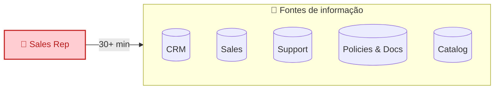
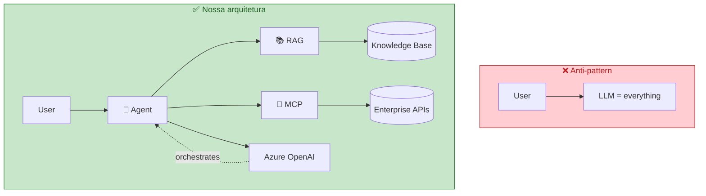
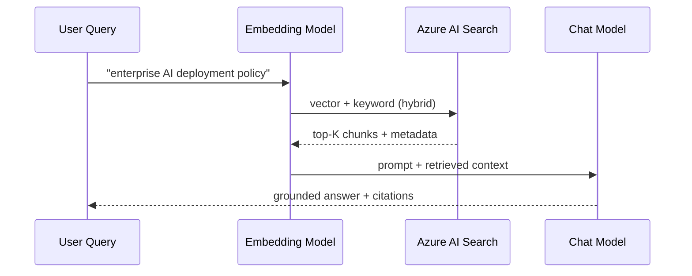
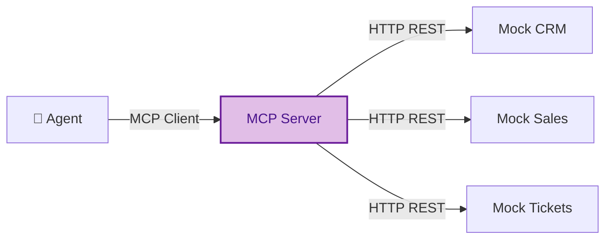
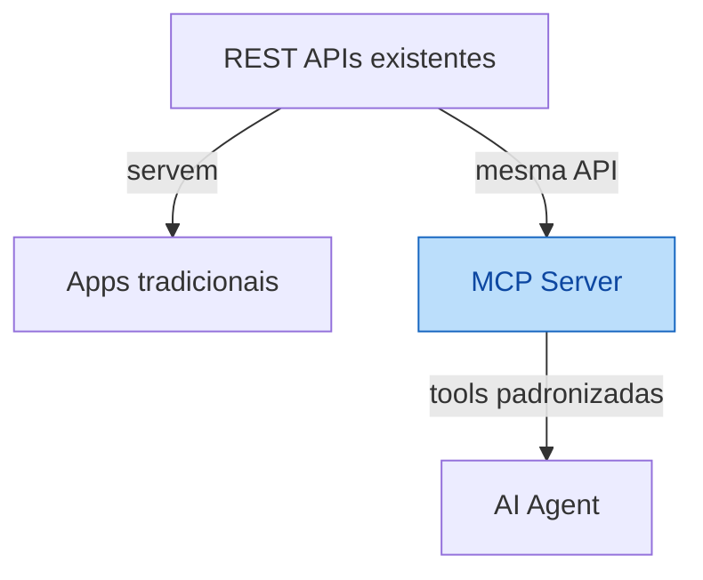
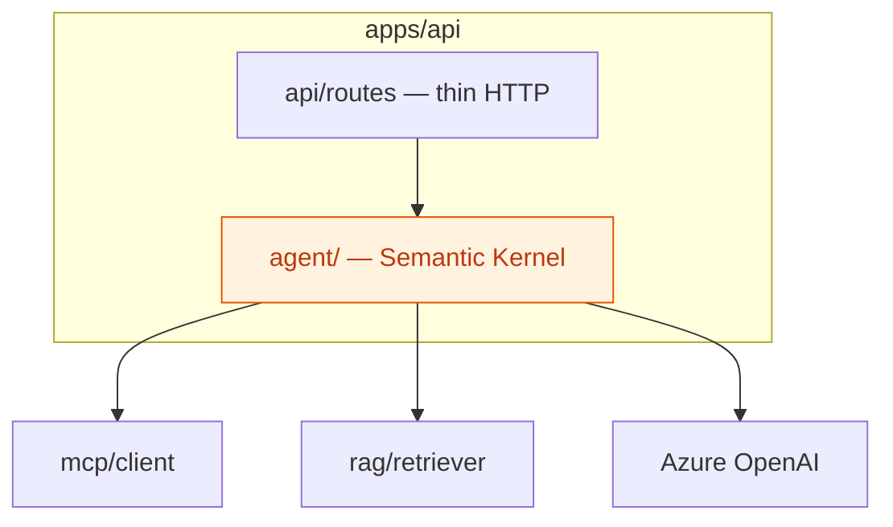
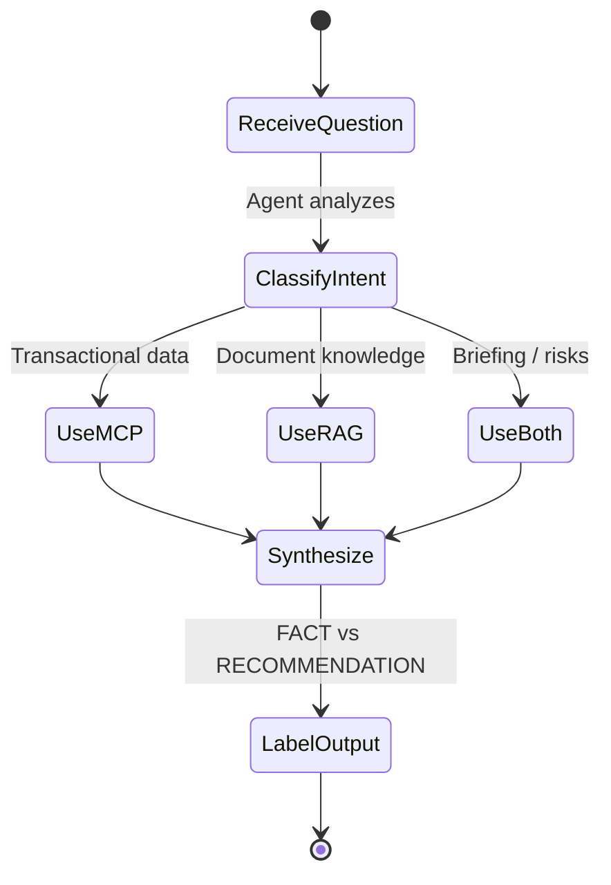

# 01 — Core Concepts

Antes de escrever código, entenda **o que** estamos construindo e **por que** não é um chatbot comum.

## O problema de negócio

Vendedores enterprise precisam de informação espalhada em vários sistemas:

**Objetivo da POC:** reduzir essa preparação para **menos de 5 minutos** com um agente que sabe *onde buscar* cada tipo de informação.

## Chatbot vs Enterprise Agent

| | Chatbot genérico | Sales Intelligence Agent |
|---|------------------|--------------------------|
| Fonte de dados | Só o modelo (memória paramétrica) | MCP (APIs) + RAG (documentos) |
| Dados transacionais | Inventa ou desatualiza | MCP → REST APIs reais |
| Políticas internas | Alucina | RAG → Azure AI Search |
| Decisão de ferramenta | Fixa ou inexistente | Agent decide MCP / RAG / both |
| Citações | Opcionais | Obrigatórias em respostas RAG |
| Fato vs opinião | Misturado | UI separa FACT vs AI RECOMMENDATION |

> **Regra de ouro:** o LLM **orquestra**; não é a base de conhecimento da empresa.

## RAG — Retrieval-Augmented Generation

**RAG** = buscar documentos relevantes *antes* de gerar a resposta.

**Quando usar RAG:**

- Políticas internas
- Documentação de produto
- Contratos em PDF/Markdown
- Qualquer conhecimento que **muda** e **não** está em API estruturada

**Quando NÃO usar RAG:**

- "Quanto ACME gastou ano passado?" → dado transacional → **MCP**

## MCP — Model Context Protocol

**MCP** expõe capacidades enterprise como **tools** que o agent invoca.

**Tools planejadas:**

| Tool | Fonte | Exemplo de uso |
|------|-------|----------------|
| `get_customer` | CRM | Perfil ACME |
| `get_customer_sales` | Sales | Receita, tendência |
| `get_customer_tickets` | Tickets | Issues abertas |
| `get_customer_contracts` | Contracts | Renewal date |
| `search_products` | Products | Catálogo |
| `get_product` | Products | Detalhe produto |

**Por que MCP e não reescrever APIs para AI?**

O MCP é uma **camada de integração AI** — não duplica regra de negócio.

## Semantic Kernel — Orquestração

**Semantic Kernel (SK)** é o framework Microsoft para:

- Pluggar LLM (Azure OpenAI)
- Registrar plugins / functions
- Conectar MCP tools
- Manter **prompts** e **orchestration** fora dos controllers HTTP

## Grounding, citations e responsible AI

| Conceito | Significado neste projeto |
|----------|---------------------------|
| **Grounding** | Resposta baseada em evidência recuperada (RAG ou API) |
| **Citation** | Listar fontes reais (`contract-acme.pdf`, `renewal-policy.md`) |
| **Hallucination** | Inventar dado de cliente — **proibido** |
| **Uncertainty** | "Não há evidência suficiente para afirmar X" |
| **FACT** | Dado vindo de MCP ou documento citado |
| **AI RECOMMENDATION** | Sugestão inferida — rotulada na UI |

## Glossário rápido

| Termo | Definição curta |
|-------|-----------------|
| **Embedding** | Vetor numérico que representa significado de texto |
| **Hybrid search** | Keyword (BM25) + vector similarity |
| **Chunk** | Pedaço de documento indexado (ex.: 800 tokens, overlap 120) |
| **Top-K** | K documentos/chunks mais relevantes retornados |
| **Tool calling** | LLM escolhe e invoca função externa (via MCP) |
| **Foundry** | Plataforma Microsoft unificada para recursos AI no Azure |

## Próximo passo

→ [02 — Architecture Overview](02-architecture-overview.md)
