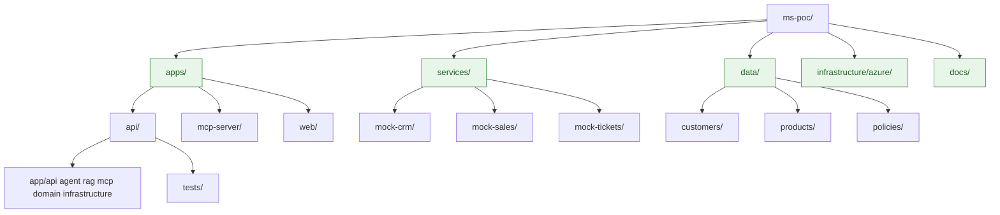
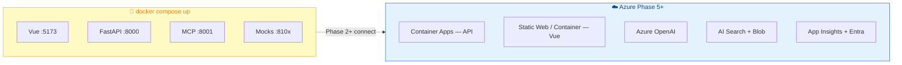
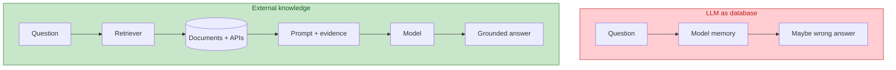
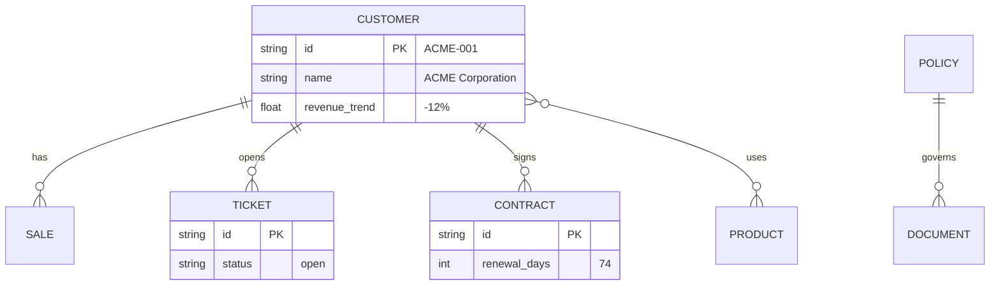

# 02 — Architecture Overview

Structural view of the monorepo, layers, and deployment.

## High-level diagram

```mermaid
flowchart TB
    subgraph UserLayer["👤 User Layer"]
        Rep[Sales Rep Browser]
    end

    subgraph Frontend["apps/web — Vue 3 + Vite"]
        Chat[Chat UI]
        Sources[Sources Panel]
        Facts[FACT / RECOMMENDATION]
    end

    subgraph Backend["apps/api — Python FastAPI"]
        API[api/v1/chat]
        Health[/health /ready]
        Agent[agent/ Semantic Kernel]
        RAGm[rag/ KnowledgeRetriever]
        MCPc[mcp/ Client]
    end

    subgraph MCPLayer["apps/mcp-server"]
        MCPS[MCP Server streamable-http]
        Tools[get_customer, get_sales, ...]
    end

    subgraph Mocks["services/ — Docker local"]
        CRM[mock-crm :8101]
        Sales[mock-sales :8102]
        Tkt[mock-tickets :8103]
    end

    subgraph Azure["☁️ Azure (Phase 2+)"]
        OAI[Azure OpenAI / Foundry]
        Search[(Azure AI Search)]
        Blob[(Blob Storage)]
        ACA[Container Apps]
        Insights[Application Insights]
        Entra[Microsoft Entra ID]
    end

    Rep --> Chat
    Chat -->|POST /api/v1/chat| API
    API --> Agent
    Agent --> MCPc
    Agent --> RAGm
    Agent --> OAI
    MCPc -->|HTTP| MCPS
    MCPS --> Tools
    Tools --> CRM
    Tools --> Sales
    Tools --> Tkt
    RAGm --> Search
    Search --> Blob
    API --> Insights
    API --> ACA
    Entra -.->|JWT Phase 6| API

    classDef azure fill:#E3F2FD,stroke:#1565C0,stroke-width:2px,color:#0D47A1
    classDef local fill:#F3E5F5,stroke:#7B1FA2,stroke-width:2px,color:#4A148C
    class Azure azure
    class Mocks,MCPLayer local
```

## Monorepo — estrutura de pastas



## Layers and responsibilities

| Layer | Folder | Responsibility | Must not |
|-------|--------|----------------|----------|
| **HTTP** | `apps/api/app/api/` | Validate request, auth, serialize response | Contain agent logic |
| **Agent** | `apps/api/app/agent/` | Intent, tool selection, synthesis | Call mock HTTP directly |
| **RAG** | `apps/api/app/rag/` | Embed, search, filter, rank | Invent content |
| **MCP client** | `apps/api/app/mcp/` | Connect to MCP server | Duplicate tools |
| **MCP server** | `apps/mcp-server/` | Expose tools, call REST | Duplicate business rules |
| **Domain** | `apps/api/app/domain/` | Types, DTOs, enums | Azure dependencies |
| **Infrastructure** | `apps/api/app/infrastructure/` | Azure clients, telemetry | Business logic |
| **UI** | `apps/web/src/` | Chat, sources, loading | Authorize by customer_id alone |

## Deployment — local vs Azure



## Default local ports

| Service | Port | Health endpoint |
|---------|------|-----------------|
| Vue | 5173 | home page |
| FastAPI | 8000 | `GET /health`, `GET /ready` |
| MCP Server | 8001 | per transport |
| Mock CRM | 8101 | `GET /health` |
| Mock Sales | 8102 | `GET /health` |
| Mock Tickets | 8103 | `GET /health` |

## Principle: LLM ↔ retrieval separation



## Dataset demo — ACME Corporation

Fictional data with intentional relationships for agent reasoning:



## Next step

→ [03 — Request Flow](03-request-flow.md)
