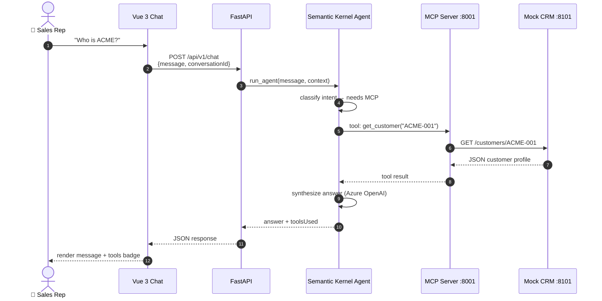
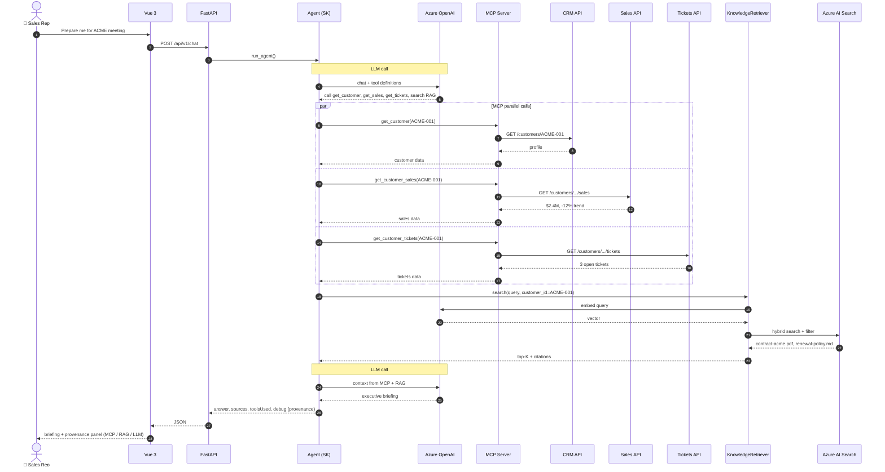
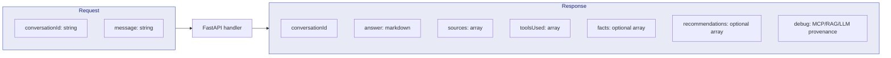
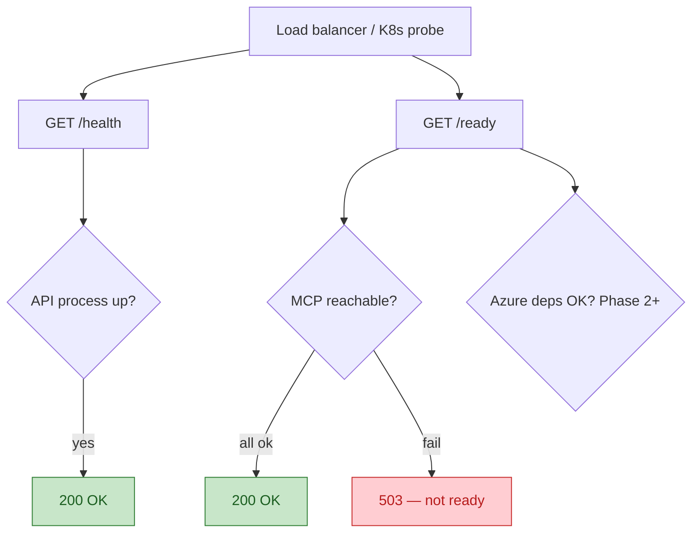
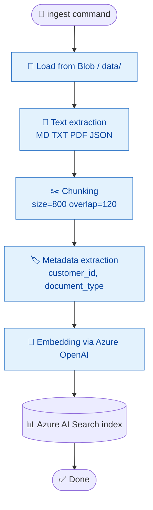
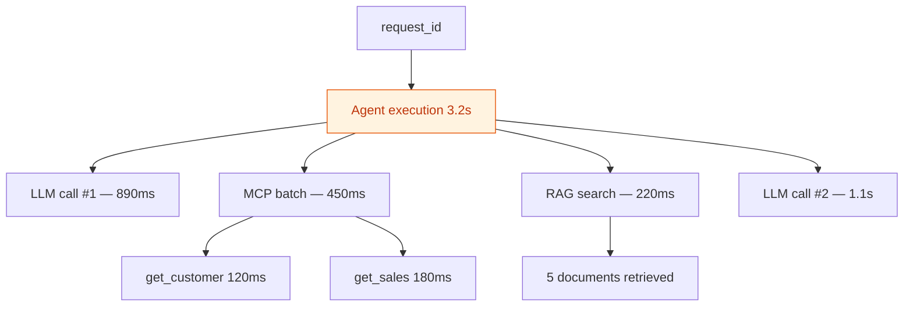

# 03 — Request Flow

End-to-end flow from user question to response — the heart of the system.

## Vertical slice — Phase 1 (MCP only)

First working delivery **without Azure** — proves Vue → Agent → MCP → CRM.



## Full flow — Phase 3+ (MCP + RAG + Azure OpenAI)

Executive briefing: *"Prepare me for my meeting with ACME."*



## API contract — POST /api/v1/chat



**Example request:**

```json
{
  "conversationId": "abc-123",
  "message": "Prepare me for my meeting with ACME"
}
```

**Example response (simplified):**

```json
{
  "conversationId": "abc-123",
  "answer": "ACME Executive Briefing\n\nFACT\nRevenue decreased 12%...",
  "sources": [
    { "title": "ACME Contract", "source": "contract-acme-2026.pdf" }
  ],
  "toolsUsed": ["get_customer", "get_customer_sales", "get_customer_tickets"],
  "debug": {
    "pipeline": ["mcp:get_customer", "mcp:get_customer_sales", "llm:synthesis"],
    "mcpCalls": [
      {
        "tool": "get_customer",
        "source": "mcp",
        "arguments": { "customer_id": "ACME-001" },
        "resultPreview": "{\"name\":\"ACME Corporation\"}",
        "durationMs": 12.3
      }
    ],
    "ragCalls": [],
    "llm": {
      "model": "gpt-4o-mini",
      "promptTokens": 1200,
      "completionTokens": 450,
      "note": "FACT bullets grounded in MCP/RAG; RECOMMENDATION is LLM-generated."
    }
  }
}
```

## Health checks



`/ready` **never** exposes connection strings or secrets — aggregated status only.

## Document ingestion (RAG pipeline)

Offline flow — command `python -m app.rag.ingest`:



## Telemetry per request (Phase 6)

Each execution produces a correlated trace:



See [observability.md](../observability.md) for details.

## Next step

→ [04 — Agent Decisions](04-agent-decisions.md)
