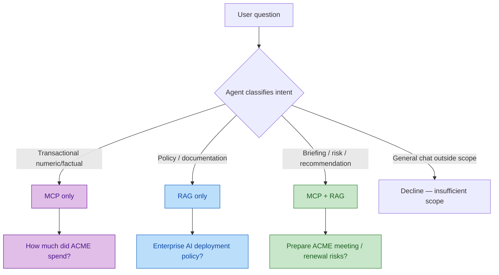
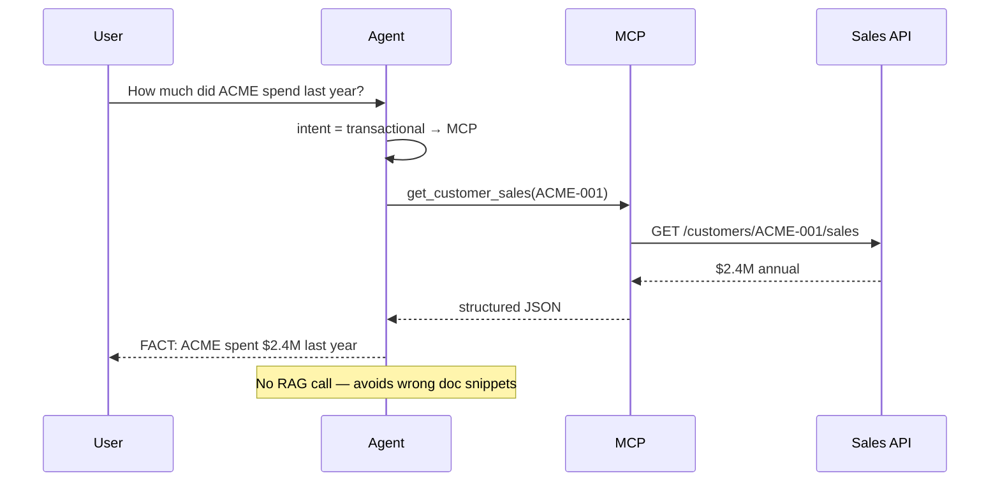
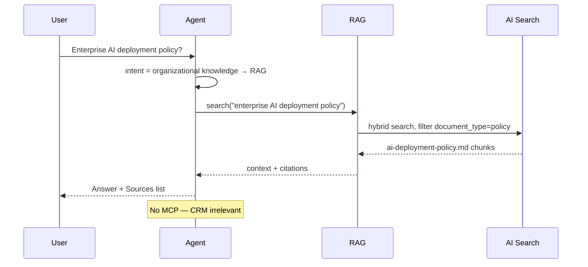
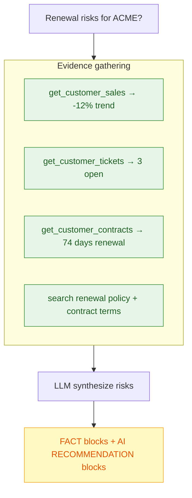
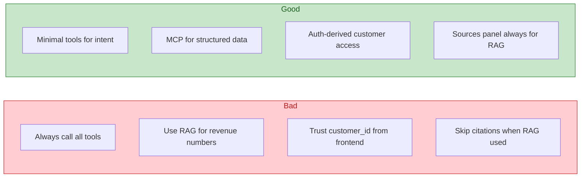

# 04 — Agent Decisions: MCP vs RAG

O diferencial desta POC é o agent **decidir** qual capacidade usar — não chamar tudo sempre.

## Árvore de decisão



## Matriz de cenários demo

| # | Pergunta | MCP | RAG | Reasoning |
|---|----------|-----|-----|-----------|
| 1 | Prepare me for my meeting with ACME | ✅ | ✅ | Briefing = dados + docs |
| 2 | How much did ACME spend last year? | ✅ | ❌ | Número em Sales API |
| 3 | What is our enterprise AI deployment policy? | ❌ | ✅ | Política em documento |
| 4 | What products should we recommend to ACME? | ✅ | ✅ | Catálogo + histórico + docs |
| 5 | Biggest risks to ACME's renewal? | ✅ | ✅ | Tickets + contract + policy |

## Fluxo por cenário

### Cenário 2 — MCP only



### Cenário 3 — RAG only



### Cenário 5 — MCP + RAG + reasoning



## System prompt — regras que guiam decisões

O prompt vive **fora** do código (`prompts/sales-agent.system.md`):

| Regra | Efeito na decisão |
|-------|-------------------|
| Never invent customer data | Prefere MCP para facts |
| Prefer structured systems for transactional info | Sales/revenue → MCP |
| Use RAG for organizational knowledge | Policies → RAG |
| Use both when necessary | Briefings |
| Cite retrieved documents | RAG responses only |
| If evidence insufficient, say so | No guessing |

## Anti-patterns a evitar



## Evaluation — medir tool selection

Dataset em `data/eval/tool-selection.json`:

```json
{
  "question": "How much did ACME spend last year?",
  "expectedTool": "get_customer_sales",
  "expectedSource": null
}
```

```json
{
  "question": "What is our enterprise AI deployment policy?",
  "expectedTool": null,
  "expectedSource": "RAG"
}
```

Métricas: tool selection accuracy, grounding rate, citation accuracy — ver [llm-evaluation skill](../../.agents/skills/llm-evaluation/SKILL.md).

## Próximo passo

→ [05 — Azure Services](05-azure-services.md)
