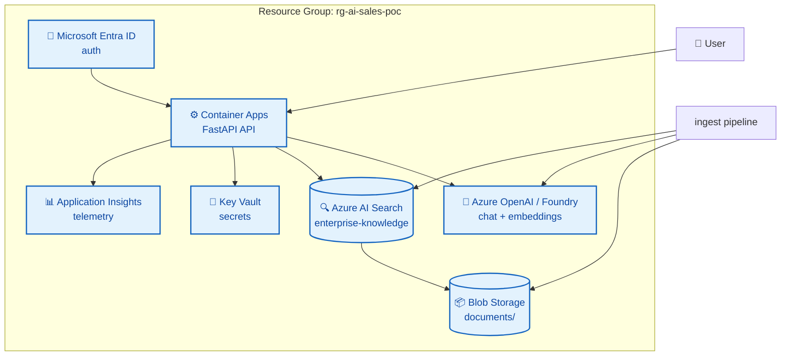
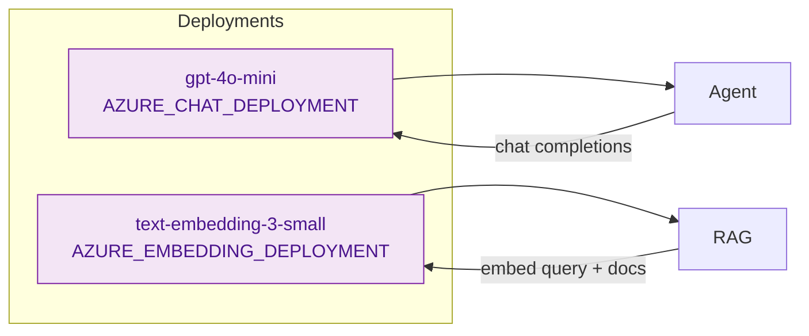
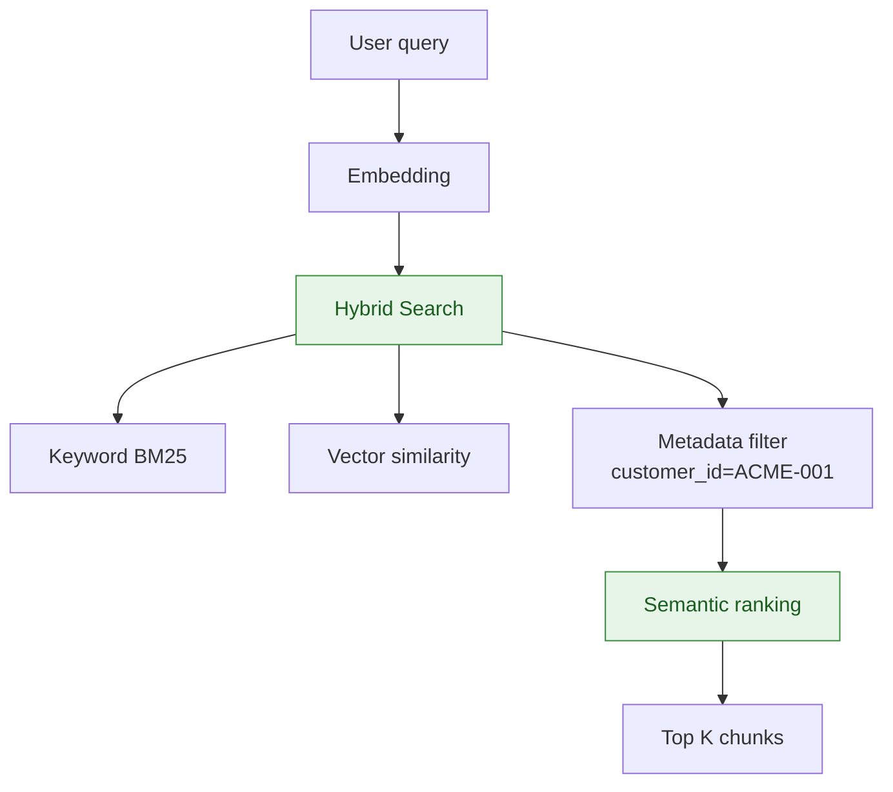
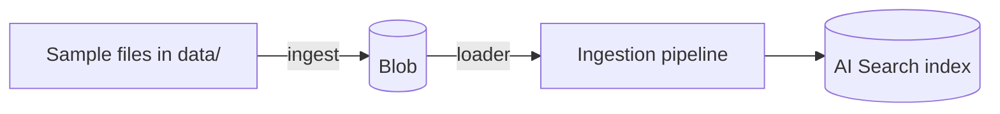
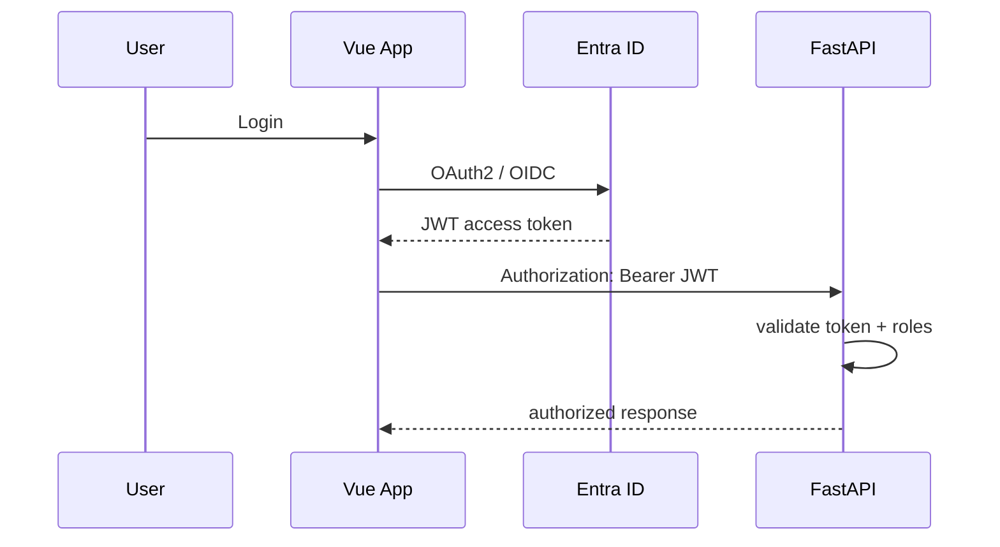

# 05 — Azure Services

Map of each Azure service in the project — **what it does**, **when it is introduced**, **how it connects**.

## Service map



## Introduction timeline

| Service | Phase | Why wait |
|---------|-------|----------|
| Mock APIs + Docker | 1 | Prove architecture at zero Azure cost |
| Azure OpenAI | 2 | Real LLM, tool calling |
| Azure AI Search | 3 | RAG, hybrid search |
| Blob Storage | 4 | Canonical document source |
| Container Apps | 5 | Managed deploy |
| Entra + Key Vault + Insights | 6 | Security + observability |

## Azure OpenAI / Microsoft Foundry

**Role:** LLM inference + embeddings.



**Env vars** (see `.env.example`):

```env
AZURE_AI_ENDPOINT=
AZURE_AI_API_KEY=
AZURE_CHAT_DEPLOYMENT=
AZURE_EMBEDDING_DEPLOYMENT=
```

**Rules:**

- Configurable models — do not hardcode deprecated API versions
- **Small** models for POC (cost)
- Do not commit keys — Key Vault in production

## Azure AI Search

**Role:** retrieval layer — **not** the LLM.

**Index `enterprise-knowledge`:**

| Field | Type | Use |
|-------|------|-----|
| `id` | string | PK |
| `content` | string | Chunk text |
| `title` | string | Document title |
| `document_type` | string | policy, contract, product |
| `customer_id` | string | Filtro ACME-001 |
| `department` | string | Filtro org |
| `source` | string | Source file name |
| `created_at` | datetime | Sort order |
| `content_vector` | vector | Dim = embedding model |



## Azure Blob Storage

Folder structure:

```text
documents/
  customers/
  products/
  contracts/
  policies/
  sales/
```



**Phase 4:** Blob becomes source of truth; local `data/` mirrors for dev.

## Azure Container Apps

**Role:** host FastAPI without managing Kubernetes.

```mermaid
flowchart TB
    subgraph ACA["Container App"]
        C1[Container: ms-poc-api]
        C1 --> Port[Port 8000]
        C1 --> Env[Env from Key Vault refs]
    end

    Ingress[HTTPS Ingress] --> ACA
    ACA --> Health[/health /ready]

    classDef container fill:#FFF3E0,stroke:#E65100,color:#BF360C
    class C1 container
```

Requisitos container:

- Listen on configured port
- Structured logs → App Insights
- No local persistent storage
- Env vars only (no secrets in image)

## Microsoft Entra ID

**Phase 6** — enterprise authentication.



**Roles:** `SALES_REP`, `SALES_MANAGER`, `ADMIN`

## Application Insights

Correlates: `request_id`, `conversation_id`, LLM/MCP/RAG latencies, token usage.

See [observability.md](../observability.md).

## Budget and region

| Config | POC value |
|--------|-----------|
| Resource group | `rg-ai-sales-poc` |
| Region | `eastus` (consistent) |
| Budget alert | ~$50 with 50/75/90/100% alerts |

Details: [cost.md](../cost.md).

## Azure CLI — essential commands

```bash
az login
az account show
az group create --name rg-ai-sales-poc --location eastus
az deployment group create --resource-group rg-ai-sales-poc --template-file infrastructure/azure/bicep/main.bicep
```

Never hardcode subscription ID — use:

```bash
SUBSCRIPTION_ID=$(az account show --query id -o tsv)
```

## Next step

→ [06 — Demo Scenarios](06-demo-scenarios.md)
