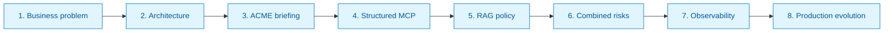
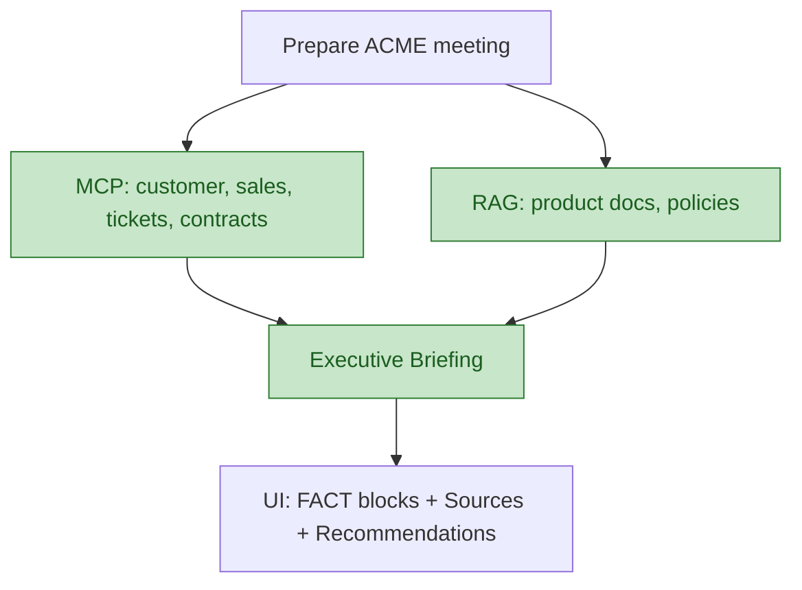
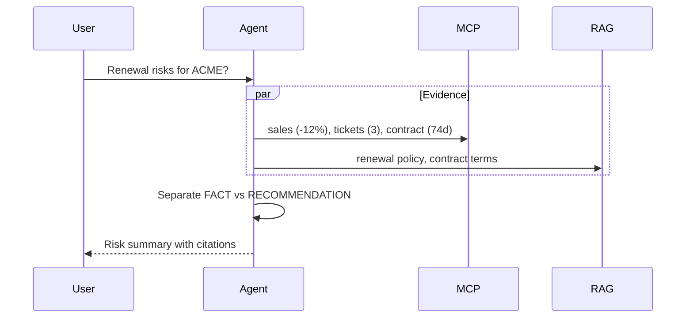

# 06 — Demo Scenarios

Os **5 cenários** que provam valor na demo de 10 minutos e na entrevista.

## Overview da demo (10 min)



## Dataset — ACME Corporation

| Atributo | Valor demo | Por quê importa |
|----------|------------|-----------------|
| Revenue trend | -12% QoQ | Risk signal |
| Open tickets | 3 | Support risk |
| Renewal | 74 days | Urgency |
| Products | Analytics + Enterprise Platform | Upsell context |
| Opportunity | Enterprise AI Automation | Talking point |

Clientes adicionais: **Globex**, **Initech** — mesma estrutura, relações diferentes.

## Cenário 1 — Executive briefing

**Input:**

```text
Prepare me for my meeting with ACME.
```

**Expected path:** MCP + RAG + Agent synthesis



**Output esperado (estrutura):**

- Customer summary
- Revenue / renewal
- Open issues
- Opportunities (AI RECOMMENDATION)
- Risks (FACT + RECOMMENDATION)
- Sources list

## Cenário 2 — Structured data only

**Input:** `How much did ACME spend last year?`

**Expected:** MCP → `get_customer_sales` — **no RAG**

**Talking point entrevista:** *"Revenue is transactional — it lives in the sales system, not in PDFs."*

## Cenário 3 — Knowledge only

**Input:** `What is our enterprise AI deployment policy?`

**Expected:** RAG → `ai-deployment-policy.md` — **no MCP**

**Talking point:** *"Policies change — they stay external to the model in Search index."*

## Cenário 4 — Product recommendation

**Input:** `What products should we recommend to ACME?`

**Expected:** MCP (history, current products) + RAG (product docs, compatibility)

## Cenário 5 — Renewal risk

**Input:** `What are the biggest risks to ACME's renewal?`

**Expected:** MCP (sales trend, tickets, contract) + RAG (renewal policy) + labeled reasoning



## UI mock — chat com sources

```text
┌──────────────────────────────────────────────┐
│ Enterprise AI Sales Intelligence             │
├──────────────────────────────────────────────┤
│ User: Prepare me for ACME.                   │
│                                              │
│ AI: ACME Executive Briefing                  │
│                                              │
│ FACT                                         │
│ Revenue decreased 12% during last quarter.   │
│                                              │
│ AI RECOMMENDATION                            │
│ Discuss adoption before expansion proposal.  │
│                                              │
│ Sources                                      │
│ • ACME Contract                              │
│ • Sales History                              │
│ • Support Tickets                            │
│ • renewal-policy.md                          │
├──────────────────────────────────────────────┤
│ Ask something...                       [Send] │
└──────────────────────────────────────────────┘
```

## Interview talking points (resumo)

| Pergunta | Resposta curta |
|----------|----------------|
| Why Agent? | Dynamic tool selection per question |
| Why MCP? | Standard AI boundary over existing REST APIs |
| Why RAG? | Fresh organizational knowledge outside model weights |
| Why AI Search? | Hybrid + filter + scale |
| Why Semantic Kernel? | Microsoft orchestration + Azure integration |
| Why Container Apps? | Managed containers without K8s complexity |

## Próximo passo

→ [07 — Development Phases](07-development-phases.md)
