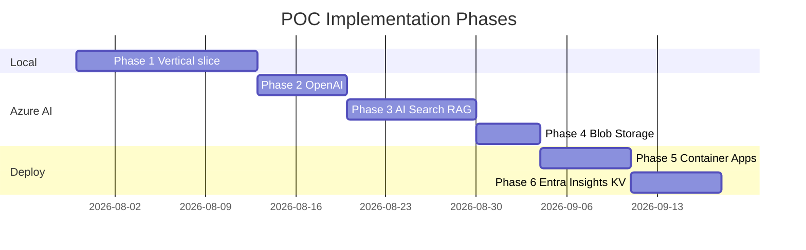
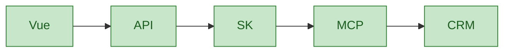
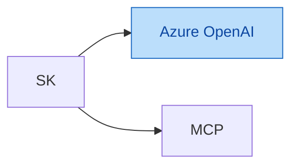
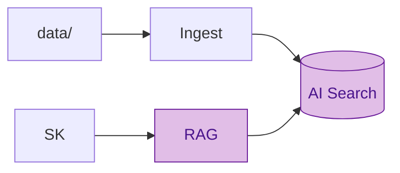
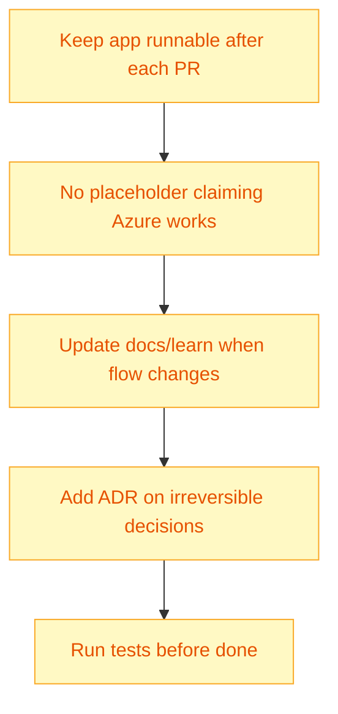

# 07 — Development Phases

Roadmap de implementação — **nunca tudo de uma vez**. Cada fase deixa o sistema executável.

## Timeline visual

## Phase 1 — Local vertical slice ✅ target first

**Stack:** FastAPI + Semantic Kernel + MCP (HTTP) + mock APIs + Vue

**Deliverables:**

- [ ] `docker compose up` sobe tudo
- [ ] `POST /api/v1/chat` responde com dados CRM via MCP
- [ ] Vue chat básico
- [ ] pytest: agent → MCP → mock API
- [ ] Mock LLM ou resposta determinística (sem Azure ainda)

**Decisões registradas:**

- Python: **uv**
- MCP transport: **streamable-http :8001**
- UI language: **English**

## Phase 2 — Azure OpenAI

**Add:** real LLM, tool calling, agent reasoning

**Validate:**

- Chat completions work
- Tool calling selects MCP tools
- Token usage logged (prep for Insights)

**Gate:** `az login` + deployments created + `.env` filled — **test against real service**

## Phase 3 — Azure AI Search + RAG

**Add:** ingestion, embeddings, hybrid search, citations

**Deliverables:**

- [ ] `python -m app.rag.ingest`
- [ ] `KnowledgeRetriever.search(query, customer_id?)`
- [ ] Citations in API response + Vue sources panel
- [ ] Scenarios 3 and 1 partial

## Phase 4 — Blob Storage

**Change:** Blob = document source of truth (local `data/` for dev mirror)

## Phase 5 — Azure Container Apps

**Deploy:** FastAPI container, Bicep modules, `/health` for probes

## Phase 6 — Entra ID + Key Vault + Application Insights

**Add:** JWT auth, secret refs, full agent execution telemetry

## Definition of Done — checklist

Ver [PLAN.md §51](../PLAN.md#51-definition-of-done) — 22 itens.

## Regras durante implementação

## Próximo passo

Implementar **Phase 1** — começar por `writing-plans` → plano em `docs/superpowers/plans/`.

Voltar ao índice: [docs/README.md](../README.md)
