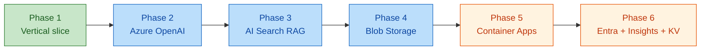
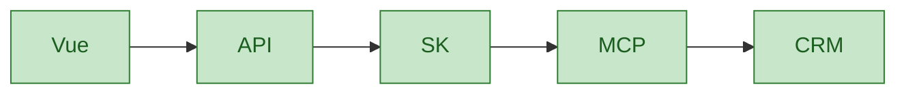
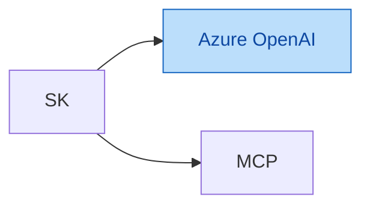
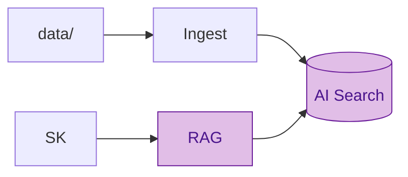
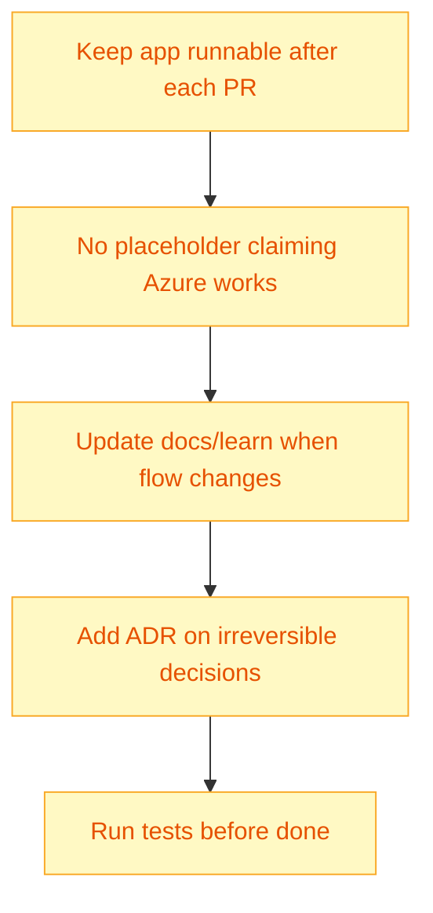

# 07 — Development Phases

Implementation roadmap — **never all at once**. Each phase leaves the system runnable.

## Timeline visual

## Phase 1 — Local vertical slice ✅ target first

**Stack:** FastAPI + Semantic Kernel + MCP (HTTP) + mock APIs + Vue

**Deliverables:**

- [x] `docker compose up` starts everything
- [x] `POST /api/v1/chat` returns CRM data via MCP
- [x] Basic Vue chat
- [x] pytest: agent → MCP → mock API
- [x] Azure OpenAI agent (Semantic Kernel) with MCP tool calling

**Recorded decisions:**

- Python: **uv**
- MCP transport: **streamable-http :8001**
- UI language: **English**

## Phase 2 — Azure OpenAI

**Add:** real LLM, tool calling, agent reasoning

**Validate:**

- Chat completions work
- Tool calling selects MCP tools
- Token usage logged (prep for Insights)

**Gate:** `az login` + deployments created + `.env` filled — **test against real service**

## Phase 3 — Azure AI Search + RAG

**Add:** ingestion, embeddings, hybrid search, citations

**Deliverables:**

- [x] `python -m app.rag.ingest`
- [x] `KnowledgeRetriever.search(query, customer_id?)`
- [x] Citations in API response + Vue sources panel
- [x] Hybrid vector + keyword search (Azure)
- [x] Scenarios 3 and 1 partial

## Phase 4 — Blob Storage ✅

**Change:** Blob = document source of truth (local `data/` for dev mirror)

- [x] Upload script + sync on startup + re-ingest to Search

**Ingestion details** (when it runs, where data persists, local fallback): [03 — Request Flow § Document ingestion](03-request-flow.md#document-ingestion-rag-pipeline) and [05 — Azure Services § RAG ingestion lifecycle](05-azure-services.md#rag-ingestion-lifecycle).

## Phase 5 — Azure Container Apps ✅

**Deploy:** FastAPI container, Bicep modules, `/health` for probes

- [x] Bicep: monitoring, storage, search, key vault, ACR, container apps with probes
- [x] `scripts/deploy-azure.sh`

## Phase 6 — Entra ID + Key Vault + Application Insights ✅

**Add:** JWT auth (JWKS), secret refs, agent execution telemetry

- [x] Entra JWT validation with JWKS
- [x] Key Vault Bicep module
- [x] AgentTracer spans + token logging

## Definition of Done — checklist

See [PLAN.md §51](../PLAN.md#51-definition-of-done) — 22 items.

## Rules during implementation

## Next step

Implement **Phase 1** — start with `writing-plans` → plan in `docs/superpowers/plans/`.

Back to index: [docs/README.md](../README.md)
