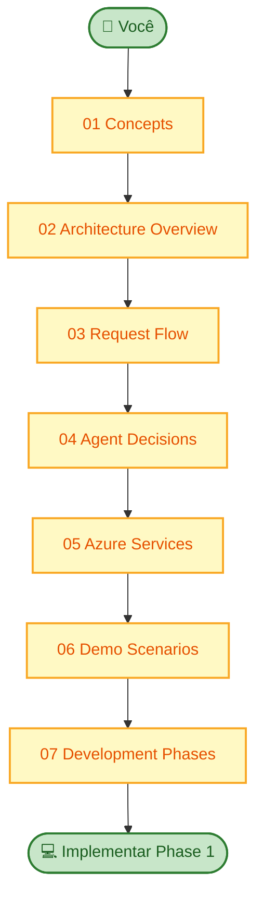

# Learning Path — Start Here

Esta pasta é o **curso prático** do projeto. Cada arquivo explica conceitos, mostra diagramas Mermaid e liga tudo ao código que vamos implementar.

## Ordem recomendada

## Por guia

| Arquivo | Tempo estimado | Pré-requisito |
|---------|----------------|---------------|
| [01-concepts.md](01-concepts.md) | 20 min | Nenhum |
| [02-architecture-overview.md](02-architecture-overview.md) | 25 min | 01 |
| [03-request-flow.md](03-request-flow.md) | 30 min | 01, 02 |
| [04-agent-decisions.md](04-agent-decisions.md) | 20 min | 01, 03 |
| [05-azure-services.md](05-azure-services.md) | 35 min | 02 |
| [06-demo-scenarios.md](06-demo-scenarios.md) | 15 min | 03, 04 |
| [07-development-phases.md](07-development-phases.md) | 15 min | 02 |

## Convenções nos diagramas

- **Retângulos** = serviços ou componentes
- **Cilindros** `[( )]` = dados persistidos (Search index, Blob)
- **Setas sólidas** = chamada síncrona / request
- **Setas tracejadas** = resposta ou fluxo de dados de volta
- **Subgrafos** = limites de deploy (Docker, Azure)

## Depois de ler

Volte a [`../README.md`](../README.md) para deep dives e ADRs.
