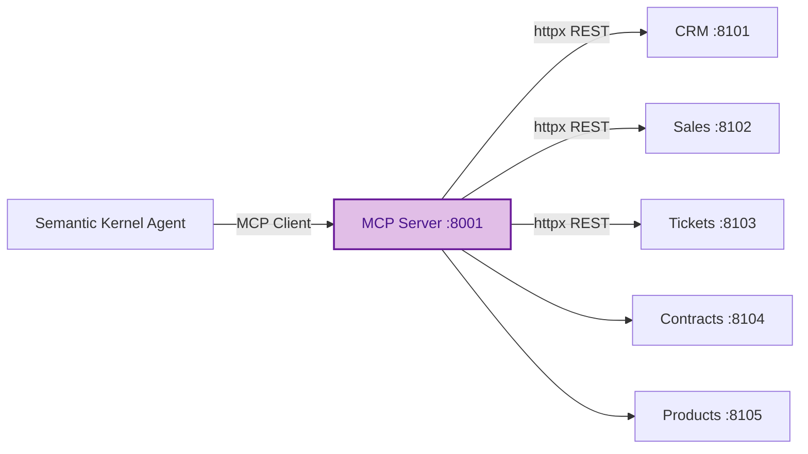
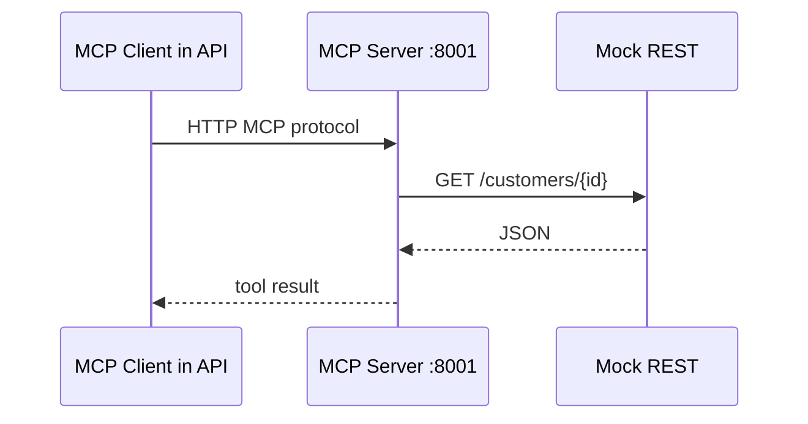
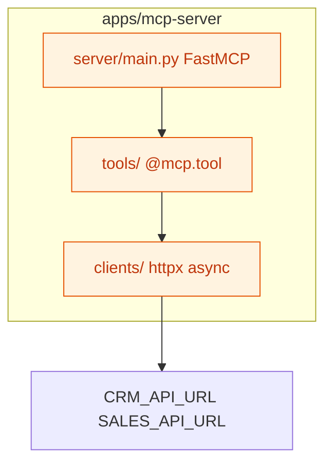
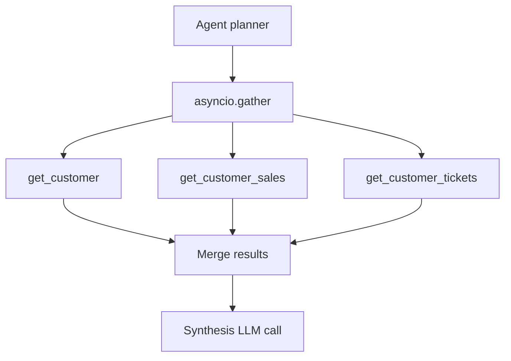

# MCP — Model Context Protocol

Deep dive on the MCP layer. Learning guide: [learn/01-concepts.md](learn/01-concepts.md).

## Role in architecture

MCP is the **AI integration boundary** between the agent and existing REST APIs.

## Transport — streamable-http

Project decision: **HTTP** (not stdio) for Docker Compose networking.

Env: `MCP_SERVER_URL=http://localhost:8001`

## Tool catalog

| Tool | REST mapping | Returns |
|------|--------------|---------|
| `get_customer` | `GET /customers/{id}` | Profile, segment |
| `get_customer_sales` | `GET /customers/{id}/sales` | Revenue, transactions |
| `get_customer_tickets` | `GET /customers/{id}/tickets` | Open/closed issues |
| `get_customer_contracts` | `GET /customers/{id}/contracts` | Renewal, terms |
| `search_products` | `GET /products?q=` | Product list |
| `get_product` | `GET /products/{id}` | Product detail |

## MCP server structure

## Design rules

| Rule | Rationale |
|------|-----------|
| No business logic duplication | REST APIs remain source of truth |
| Typed tool inputs/outputs | Pydantic models for LLM schema |
| Async I/O | Parallel tool calls via httpx |
| Error mapping | HTTP errors to structured tool errors |
| No secrets in responses | Never leak keys or internal URLs |

## Parallel tool execution

## ADR

See [ADR-002: Why MCP](adrs/ADR-002-mcp.md).
