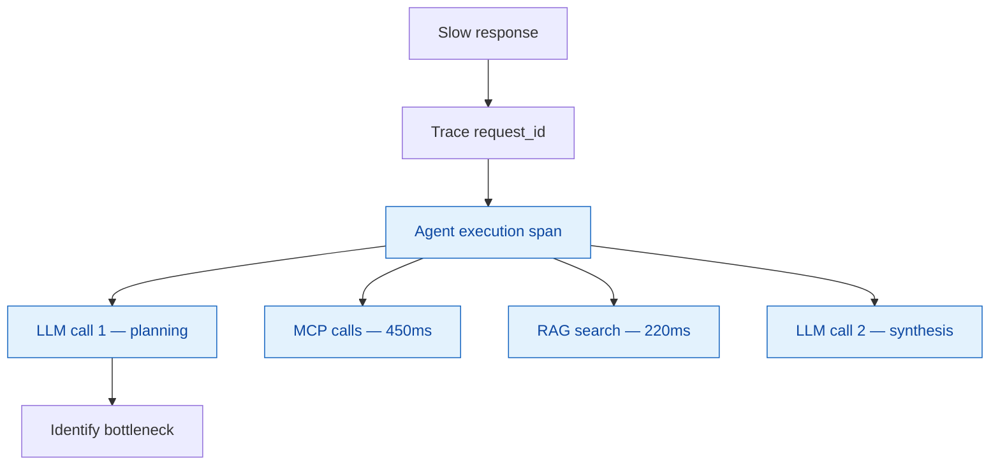
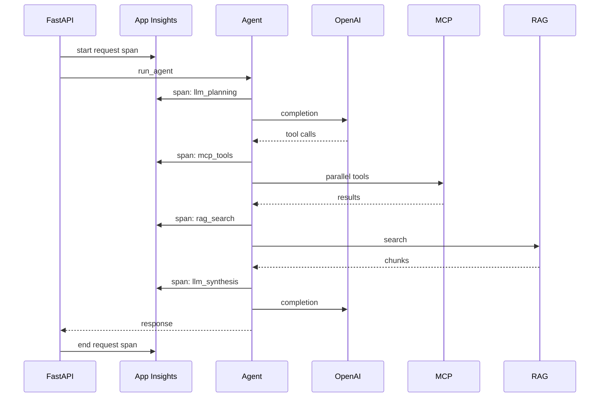

# Observability

Application Insights and AI-specific telemetry.

## Why observability matters for agents

> "Why did this agent response take 5 seconds?"



## Correlation dimensions

| Field | Purpose |
|-------|---------|
| `request_id` | Single HTTP request |
| `conversation_id` | Multi-turn chat |
| `user_id` | Authenticated subject |
| `customer_id` | Business context (when authorized) |

## Agent execution trace (example)

```text
Agent Execution — 3.2s
├── LLM call #1 — 890ms (tool planning)
├── MCP get_customer — 120ms
├── MCP get_sales — 180ms
├── MCP get_tickets — 150ms
├── RAG search — 220ms (5 docs)
├── LLM call #2 — 1100ms (synthesis)
└── Tokens: in=2300 out=650
```



## What to log

| Log | Include | Exclude |
|-----|---------|---------|
| Tool name | yes | — |
| Latency ms | yes | — |
| Token counts | yes | — |
| Retrieved doc titles | yes | full doc body |
| Customer PII | minimal IDs | emails, phones |

## Health vs readiness

| Endpoint | Checks |
|----------|--------|
| `/health` | Process alive |
| `/ready` | MCP reachable, Azure deps (Phase 2+) |

Never return connection strings in health responses.

## Phase introduction

| Phase | Telemetry |
|-------|-----------|
| 1 | Structured JSON logs to stdout |
| 6 | Application Insights + custom metrics |

Env: `APPLICATIONINSIGHTS_CONNECTION_STRING`
