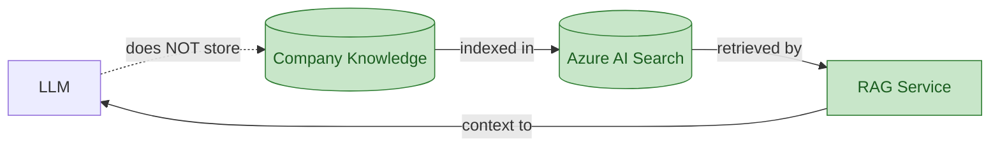
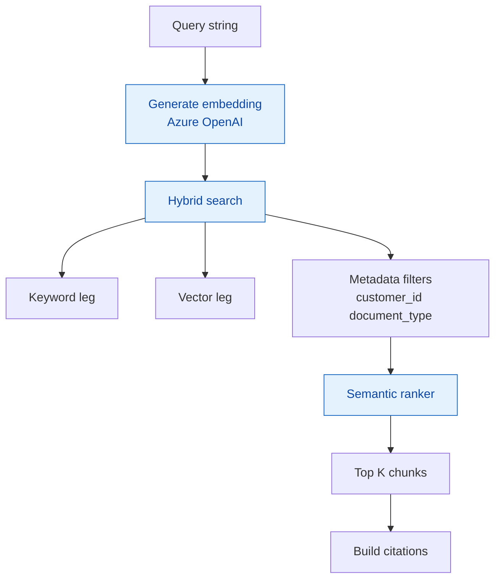
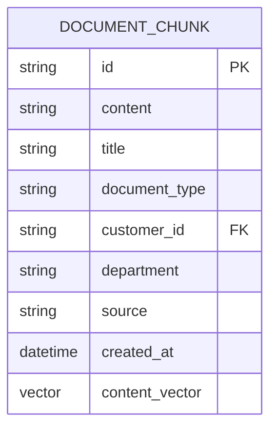
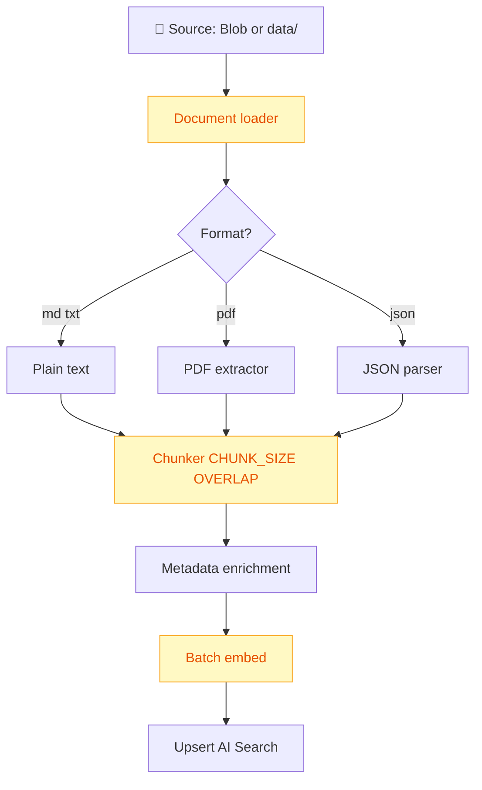

# RAG — Retrieval-Augmented Generation

Deep dive on knowledge retrieval. Learning: [learn/01-concepts.md](learn/01-concepts.md), [learn/04-agent-decisions.md](learn/04-agent-decisions.md).

## Principle



## KnowledgeRetriever interface

```python
class KnowledgeRetriever:
    async def search(
        self,
        query: str,
        customer_id: str | None = None,
    ) -> SearchResult:
        ...
```

## Search pipeline



## Index schema — enterprise-knowledge



**Vector dimensions** must match embedding deployment — verify model, do not hardcode.

## Ingestion pipeline

Command: `python -m app.rag.ingest`



### Chunking configuration

| Env var | Default | Effect |
|---------|---------|--------|
| `CHUNK_SIZE` | 800 | Larger → more context, less precision |
| `CHUNK_OVERLAP` | 120 | Overlap preserves sentence boundaries |

**Why overlap matters:** without it, facts split across chunk boundaries may never retrieve together.

## Citations contract

Every RAG-influenced answer must include:

```text
Sources:
- contract-acme-2026.pdf
- renewal-policy.md
```


**Never cite a source not in retrieved set** — hallucinated citations fail evaluation.

## When NOT to use RAG

| Question type | Use instead |
|---------------|-------------|
| Revenue, spend, counts | MCP → Sales API |
| Customer profile fields | MCP → CRM |
| Open ticket count | MCP → Tickets API |

See decision matrix in [learn/04-agent-decisions.md](learn/04-agent-decisions.md).

## Cost optimizations

- Cache embeddings for unchanged documents
- Small embedding model (`text-embedding-3-small`)
- Limit Top-K (e.g. 5 chunks)
- Small demo dataset

See [cost.md](cost.md).

## ADR

[ADR-003: Why Azure AI Search](adrs/ADR-003-azure-ai-search.md), [ADR-004: RAG vs API](adrs/ADR-004-rag-vs-structured-api.md).
