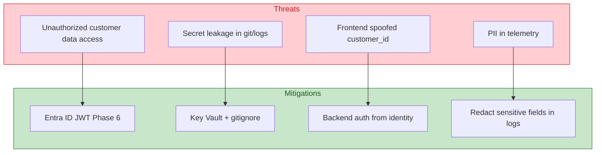
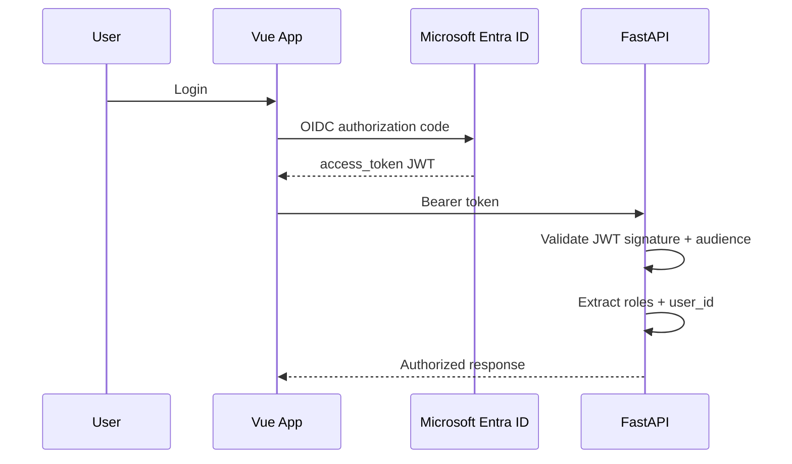
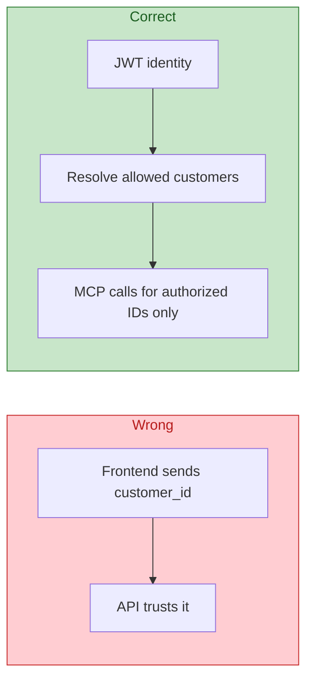

# Security

Auth, authorization, and secrets for the Sales Intelligence POC.

## Threat model (POC scope)

## Authentication flow (production target)

## Roles

| Role | Capabilities |
|------|--------------|
| `SALES_REP` | Own accounts, chat, briefings |
| `SALES_MANAGER` | Team accounts + reports |
| `ADMIN` | Full access, config |

## Authorization rule — critical

**Never authorize using only `customer_id` from the frontend.**

## Phase 1 — local dev auth

Until Entra is wired:

- `DEV_AUTH_ENABLED=true` in `.env` (local only)
- Mock user with fixed role for development
- Document clearly — **not for production**

## Secrets management

| Environment | Storage |
|-------------|---------|
| Local | `.env` (gitignored) |
| Azure | Key Vault references in Container Apps |
| CI/CD | GitHub Secrets (future) |

**Never commit:** API keys, passwords, tokens, client secrets, connection strings with keys.

See root [`.gitignore`](../.gitignore).

## Production security evolution

Documented for interview — not all implemented in POC:

- Managed Identity (no keys in app)
- Private Endpoints for Search/OpenAI
- VNet integration for Container Apps
- Azure Policy + Defender for Cloud
- RBAC on Search index by department

See [PLAN.md §45](PLAN.md#45-security-evolution).

## ADR

[ADR-006: Agent security model](adrs/ADR-006-agent-security.md).
